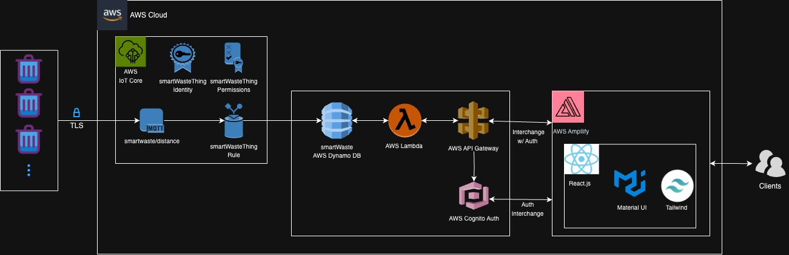
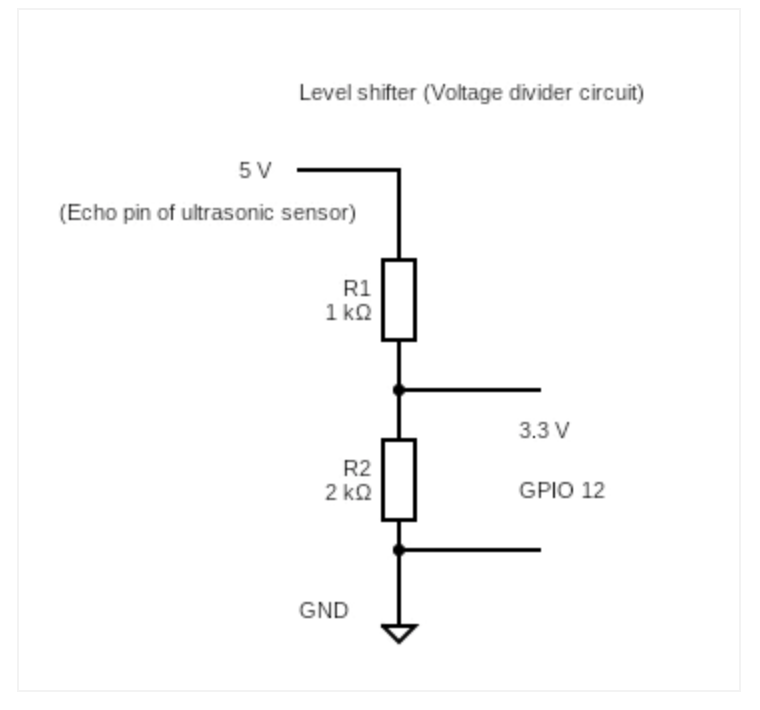
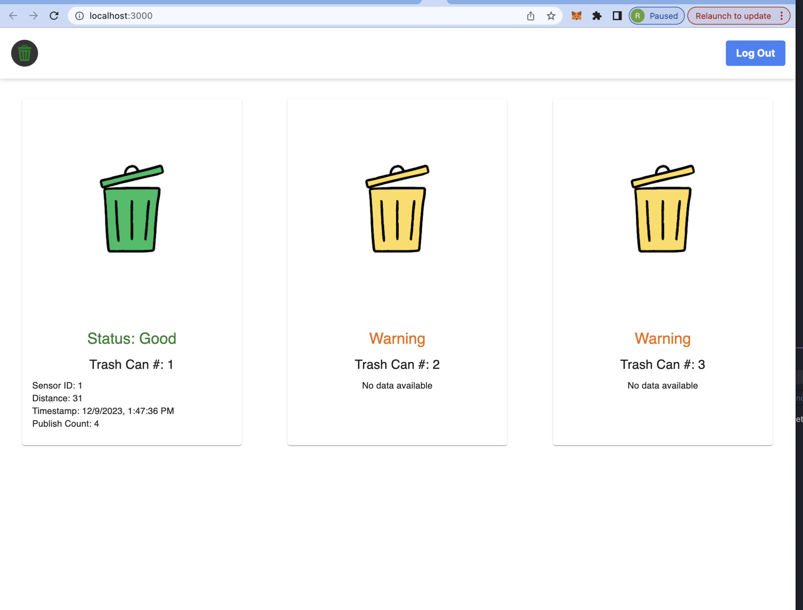

# Smart-Waste Monorepo

### Problem 
Inefficient monitoring of trash cans leads to operational challenges, including frequent overflows and spillage. This inconsistency burdens cleaning staff who manage multiple trash bins, negatively impacting their operational efficiency.

### Vision
Our vision is to create a fully connected waste management analytics system. By outfitting trash and recycling bins with sensors and connectivity, we want to build a network that provides real-time bin fill status and more for intutionals includings goverments, schools, and enterprises.

# Diagrams 

### High Level Software Architecture

### High Level Hardware Architecture

### Voltage Diagram

### Frontend 

# Quick Use 

### Starting Ultra Sonic Sensor for the Trash Can(s)
- ssh briggsrrr@briggsrrr.local
- ./SmartWaste/iot-things/ultrasonic/start.sh SENSORID/ALL

### Starting Camera Sensor for the Trash Can(s) NOTE:INCOMPLETE
- ssh briggsrrr@briggsrrr.local
- ./SmartWaste/iot-things/camera/start.sh SENSORID/ALL

### Starting Frontend
- cd amplify-frontend/
- npm start

### Starting Message Service NOTE:INCOMPLETE
- cd message-service/
- uvicorn main:app --reload

# Links

|     Link for     | Link                              | 
|:-------------------|:----------------------------------|
|Weekly Meeting Notes| [link](https://docs.google.com/document/d/1GXyXUnTMKGIcYvyj-8aEd7spdDEeYQJQScLqdhkhCxc/edit?usp=sharing)   |
|Vision              | [link](https://docs.google.com/document/d/19BQFE9qavzx0fWWvS-5EhH40ZsDCvB0uqDrFN7ACtwo/edit?usp=sharing)   |
|Video               | [link](https://drive.google.com/file/d/1SWTUXYR9hFK_UC1rnRJ8pPk7njHYbbI1/view?usp=drive_link)   |
|Demo/Slides         | [link](https://docs.google.com/presentation/d/12mB6Wt0_9NVAGVgqEKEsMamqNH9BfbzvOCWJjXsjpRA/edit?usp=sharing)   |
|Report         | [link](https://docs.google.com/document/d/19naAlF-WZHx4WcmtdK7g36si8uxYRJT2kJ9caVkM0CQ/edit?usp=sharing)   |

